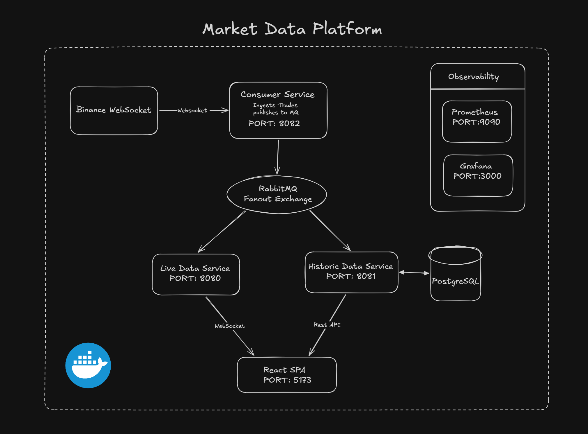

# MarketDataPlatform

A real-time cryptocurrency market data pipeline built with a **microservices architecture**. The platform ingests live trade data from the **Binance Futures WebSocket API**, distributes it via **RabbitMQ** to downstream consumers, and presents it through a **React + TypeScript** frontend with interactive professional-grade candlestick charts.

---

## Architecture Overview



---

## Technology Stack

| Layer              | Technologies                                                                  |
| ------------------ | ----------------------------------------------------------------------------- |
| **Backend**        | Java 17, Spring Boot 4.0.2, Spring AMQP, Spring WebSocket, Spring Data JPA   |
| **Message Broker** | RabbitMQ (CloudAMQP), Fanout Exchange pattern                                 |
| **Database**       | PostgreSQL (Neon serverless), Hibernate ORM, HikariCP                         |
| **Caching**        | Caffeine (in-memory, 500 entries, 10 min TTL)                                 |
| **Monitoring**     | Micrometer, Prometheus, Grafana (pre-provisioned dashboards)                  |
| **Frontend**       | React 19, TypeScript 5.9, Vite 7, Lightweight Charts (TradingView) v4.2      |
| **Infrastructure** | Docker, Docker Compose, Nginx (reverse proxy), multi-stage builds             |
| **Build Tools**    | Maven (backend), npm / Vite (frontend)                                        |

---

## Microservices

### 1. WebConsumer (Port 8082)

**Responsibility:** Connects to the Binance Futures WebSocket stream, validates incoming trade data, and publishes valid trades to RabbitMQ.

| Class                  | Purpose                                                                                                     |
| ---------------------- | ----------------------------------------------------------------------------------------------------------- |
| `WebConsumerApplication` | Spring Boot entry point                                                                                   |
| `WebSocketHandler`     | Extends `TextWebSocketHandler` — receives raw JSON from Binance, validates price/quantity > 0, forwards to RabbitMQ |
| `RabbitMQService`      | Wraps `RabbitTemplate.convertAndSend()` — publishes to the FanoutExchange with latency tracking             |
| `WebSocketConfig`      | Creates a `WebSocketConnectionManager` connecting to Binance with API key injection                         |
| `RabbitMQConfig`       | Declares a durable FanoutExchange (`binance.trade.exchange`)                                                |
| `JacksonConfig`        | JSON mapper bean (Jackson 3.x)                                                                              |
| `BinanceHealthIndicator` | Custom `HealthIndicator` — reports WebSocket connection status                                            |

**Key Concepts:**
- WebSocket client connection to an external API
- Data validation at ingestion
- Decoupled publishing via message queue

---

### 2. LiveData (Port 8080)

**Responsibility:** Consumes raw trades from RabbitMQ, aggregates them into OHLCV candles on a configurable interval (500ms), and broadcasts to connected frontend clients via native WebSocket.

| Class                    | Purpose                                                                                                       |
| ------------------------ | ------------------------------------------------------------------------------------------------------------- |
| `LiveDataApplication`   | Spring Boot entry point                                                                                       |
| `DataListener`          | `@RabbitListener` — receives trade JSON from `binance.live.queue`, delegates to aggregator                    |
| `TradeAggregatorService`| Core aggregation engine — accumulates trades in `ConcurrentHashMap<String, LiveCandle>`, scheduled broadcast every 500ms |
| `LiveCandle`            | Thread-safe POJO with `synchronized` methods: `addTrade()`, `snapshot()`, `reset()` for safe concurrent access |
| `LiveDataSocketHandler` | WebSocket server handler — manages client sessions per symbol, broadcasts candle JSON to subscribers          |
| `WebSocketConfig`       | Registers WebSocket endpoint at `ws/live@*` with configurable CORS                                           |
| `RabbitMQConfig`        | Declares FanoutExchange + Queue (`binance.live.queue`) + Binding                                              |
| `LiveDataHealthIndicator` | Reports active sessions count and per-symbol breakdown                                                      |

**Key Concepts:**
- Real-time trade-to-candle aggregation
- Thread-safe concurrent data structures
- Observer pattern with WebSocket session subscriptions
- Snapshot/Copy pattern for safe periodic reads
- Scheduled task execution with `ScheduledExecutorService`
- Graceful shutdown with `@PreDestroy`

---

### 3. PastDataService (Port 8081)

**Responsibility:** Consumes raw trades from RabbitMQ, batch-inserts into PostgreSQL, and serves historical OHLCV candlestick data via a REST API with server-side aggregation and caching.

| Class                    | Purpose                                                                                                          |
| ------------------------ | ---------------------------------------------------------------------------------------------------------------- |
| `PastDataServiceApplication` | Spring Boot entry point                                                                                    |
| `DataListener`          | `@RabbitListener` with batch buffering — accumulates 100 trades before flushing to DB                            |
| `TradeController`       | `@RestController` — `GET /trades/{symbol}` with validated query params (`from`, `to`, `tickSize`)                |
| `TradeService`          | Business logic — cache-aside lookups, tick-size parsing, delegation to repository                                |
| `TradeRepository`       | `JpaRepository` with custom native SQL — uses PostgreSQL `ARRAY_AGG` for OHLCV aggregation by time bucket       |
| `Trade`                 | JPA `@Entity` — composite index on `(symbol, trade_time)` for optimized queries                                  |
| `CreateTradeDto`        | Maps Binance JSON fields to domain objects                                                                       |
| `CandleDto`             | Response DTO for aggregated candle data using `@Builder`                                                         |
| `CorsConfig`            | Global `CorsFilter` for cross-origin frontend access                                                             |
| `CacheConfig`           | Caffeine cache: 500 entries max, 10 min expiry, stats recording                                                  |
| `PastDataHealthIndicator` | Reports batch processing health (buffer size, totals, last batch time)                                         |

**REST API:**

| Method | Path               | Parameters                                                             | Response        |
| ------ | ------------------ | ---------------------------------------------------------------------- | --------------- |
| `GET`  | `/trades/{symbol}` | `from` (ISO DateTime), `to` (ISO DateTime), `tickSize` (1s–1d regex) | `List<CandleDto>` |

**Key Concepts:**
- Batch buffering and bulk inserts
- Native SQL with PostgreSQL `ARRAY_AGG` for OHLC computation
- Cache-Aside pattern with Caffeine
- Input validation with Jakarta Validation (`@NotBlank`, `@Size`, `@Pattern`)
- Hibernate batch optimization (`batch_size: 100`, `order_inserts: true`)

---

## Message Queue Architecture

The platform uses a **Fanout Exchange** (Pub/Sub) pattern where every trade is broadcast to all consumers:

```
WebConsumer (Producer)
        │
        ▼
FanoutExchange: binance.trade.exchange (durable)
        │
        ├──► binance.live.queue  (durable) ──► LiveData
        └──► binance.db.queue    (durable) ──► PastDataService
```

- **FanoutExchange** ensures both consumers receive a copy of every trade
- Each downstream service independently declares its own queue and binding
- Prefetch count of 100 on both consumers for throughput optimization
- Durable queues and exchange for message reliability

---

## Frontend

**Stack:** React 19 · TypeScript 5.9 · Vite 7 · Lightweight Charts (TradingView) 4.2

### Component Architecture

```
App (Tab navigation: Live | Historical)
├── LiveChart      — Real-time candlestick chart via WebSocket
└── PastDataChart  — Historical candlestick chart via REST API
```

### Features

- **Professional candlestick charts** with TradingView's Lightweight Charts library
- **Volume histogram overlay** scaled to 20% of chart height
- **Real-time streaming** with auto-scroll to latest bar
- **OHLCV legend overlay** on crosshair hover
- **Connection status indicator** (green/red dot)
- **Responsive sizing** via `ResizeObserver`
- **Symbol selector** supporting BTCUSDT, ETHUSDT, BNBUSDT, SOLUSDT, XRPUSDT
- **Configurable tick sizes** (1s, 1m, 5m, 15m, 1h, 4h, 1d) for historical data
- **Date range picker** for historical queries
- **Summary statistics** (high, low, price change, total trades)

### Custom Hooks

| Hook            | Purpose                                                                                     |
| --------------- | ------------------------------------------------------------------------------------------- |
| `useLiveData`   | WebSocket lifecycle management — connect/disconnect/reconnect (3s auto-retry), rolling buffer of 100 data points |
| `usePastData`   | REST API integration — fetch with date formatting via `date-fns`, loading/error state management |

### Frontend Design Patterns

- **Custom Hooks** — separation of data-fetching logic from UI
- **Controlled Components** — symbol selectors, date inputs bound to React state
- **Refs for imperative APIs** — `useRef` manages chart instances without triggering re-renders
- **Declarative conditional rendering** — loading, error, and connection states

---

## Database

**PostgreSQL** (Neon serverless) with the following schema:

**Table: `trades`**

| Column          | Type          | Constraints                    |
| --------------- | ------------- | ------------------------------ |
| `id`            | VARCHAR (UUID)| Primary Key, auto-generated    |
| `symbol`        | VARCHAR       | NOT NULL                       |
| `trade_id`      | BIGINT        | NOT NULL                       |
| `price`         | DOUBLE        | NOT NULL                       |
| `quantity`      | DOUBLE        | NOT NULL                       |
| `trade_type`    | VARCHAR       | NOT NULL                       |
| `is_buyer_maker`| BOOLEAN       | NOT NULL                       |
| `event_time`    | BIGINT        | NOT NULL                       |
| `trade_time`    | BIGINT        | NOT NULL                       |

**Index:** `idx_symbol_tradetime` on `(symbol, trade_time)` — optimizes the candlestick aggregation query.

**Native SQL Aggregation:**

```sql
SELECT
    (trade_time / :tickMs) * :tickMs AS open_time,
    (ARRAY_AGG(price ORDER BY trade_time ASC))[1] AS open,
    MAX(price) AS high,
    MIN(price) AS low,
    (ARRAY_AGG(price ORDER BY trade_time DESC))[1] AS close,
    SUM(quantity) AS volume,
    COUNT(*) AS trade_count
FROM trades
WHERE symbol = :symbol
  AND trade_time >= :fromEpoch AND trade_time <= :toEpoch
  AND price > 0 AND quantity != 0
GROUP BY 1 ORDER BY 1 ASC
```

Uses PostgreSQL's `ARRAY_AGG` with ordering to extract first/last prices within each time bucket — computing open/close in a single query pass.

---

## Observability & Monitoring

### Prometheus

- Scrapes all three microservices at `/actuator/prometheus`
- 1-second scrape interval for high-frequency real-time monitoring

### Custom Metrics

**WebConsumer:**

| Metric                          | Type    | Description                           |
| ------------------------------- | ------- | ------------------------------------- |
| `binance.trades.received`       | Counter | Trades received from Binance          |
| `binance.websocket.errors`      | Counter | WebSocket transport errors            |
| `binance.trades.invalid`        | Counter | Trades with invalid price/quantity    |
| `rabbitmq.messages.trades.sent` | Counter | Messages published to RabbitMQ        |
| `rabbitmq.publish.errors`       | Counter | RabbitMQ publish failures             |
| `rabbitmq.messages.publish.time`| Timer   | Publishing latency                    |

**LiveData:**

| Metric                           | Type    | Description                            |
| -------------------------------- | ------- | -------------------------------------- |
| `live.candles.broadcast`         | Counter | Aggregated candles broadcast           |
| `live.symbols.tracked`           | Gauge   | Number of symbols being aggregated     |
| `live.ws.active.sessions`        | Gauge   | Active WebSocket client sessions       |
| `live.messages.broadcast`        | Counter | Messages sent to clients               |
| `live.ws.send.errors`            | Counter | Failed WebSocket sends                 |
| `live.candle.broadcast.duration` | Timer   | Time per broadcast cycle               |

**PastDataService:**

| Metric                           | Type    | Description                            |
| -------------------------------- | ------- | -------------------------------------- |
| `pastdata.trades.received`       | Counter | Trades received from RabbitMQ          |
| `pastdata.batch.insert`          | Timer   | Batch DB insert duration               |
| `pastdata.candle.query.duration` | Timer   | Candlestick aggregation query duration |
| `pastdata.cache.hits`            | Counter | Caffeine cache hits                    |
| `pastdata.cache.misses`          | Counter | Caffeine cache misses                  |

### Grafana Dashboard

Pre-provisioned dashboard with 14 panels across 3 sections:

- **WebConsumer — Binance Ingestion:** Trade rate, WebSocket errors, invalid trade rate
- **LiveData — Aggregation & Broadcast:** Candle broadcast rate, tracked symbols, active sessions, broadcast duration, send errors
- **PastDataService — Queries & Caching:** Query duration, cache hit rate gauge (color-coded thresholds), cache hits vs misses, trade receive rate, batch insert duration

Auto-refreshes every 5 seconds with a default 30-minute time window.

### Custom Health Indicators

Each service implements `HealthIndicator` for domain-specific health reporting via Spring Actuator:

- **WebConsumer:** Binance WebSocket connection status and URL
- **LiveData:** Active session count, per-symbol session breakdown, tracked symbols
- **PastDataService:** Buffer size, total trades received, total batches inserted, last batch time

---

## Design Patterns & Concepts

| Pattern / Concept                  | Where Applied                                                                         |
| ---------------------------------- | ------------------------------------------------------------------------------------- |
| **Microservices Architecture**     | Three independently deployable services with distinct responsibilities                |
| **Event-Driven Architecture**      | RabbitMQ decouples producer from consumers                                            |
| **Fanout (Pub/Sub) Pattern**       | Single exchange broadcasts to multiple queues                                         |
| **WebSocket (Native)**             | Binance → WebConsumer (client), LiveData → Frontend (server)                          |
| **Batch Processing**               | PastDataService buffers 100 trades before DB flush                                    |
| **CQRS-like Separation**           | Write path (MQ → batch insert) vs Read path (REST + caching)                         |
| **Observer Pattern**               | WebSocket sessions subscribe to symbols; broadcasts notify all observers              |
| **Snapshot Pattern**               | `LiveCandle.snapshot()` creates thread-safe copies for broadcasting                   |
| **DTO Pattern**                    | Separate inbound (`CreateTradeDto`) and outbound (`CandleDto`) API contracts          |
| **Repository Pattern**             | Spring Data JPA with custom native queries                                            |
| **Cache-Aside Pattern**            | Check Caffeine cache before executing DB query                                        |
| **Builder Pattern**                | `CandleDto.builder()`, Micrometer metric builders                                    |
| **Multi-Stage Docker Builds**      | Separate build/runtime images for minimal container size                              |
| **Infrastructure as Code**         | Prometheus config, Grafana dashboards & datasources provisioned via files              |
| **Custom Health Indicators**       | Domain-specific health checks beyond Spring Boot defaults                             |
| **Metrics-Driven Observability**   | Counters, Gauges, and Timers at every critical path                                   |
| **Connection Pooling**             | HikariCP for PostgreSQL (5–10 connections)                                            |
| **Hibernate Batching**             | `batch_size: 100` + `order_inserts: true` for efficient bulk writes                   |
| **Thread Safety**                  | `synchronized` methods, `ConcurrentHashMap`, `ConcurrentLinkedQueue`, `AtomicLong`    |
| **Graceful Shutdown**              | `@PreDestroy` flushes buffers and stops schedulers                                    |
| **Input Validation**               | Jakarta Validation annotations on controller parameters                               |
| **CORS Configuration**             | Server-side `CorsFilter` for cross-origin frontend access                             |
| **Custom React Hooks**             | Encapsulated data-fetching and WebSocket lifecycle logic                               |
| **Responsive Chart Rendering**     | `ResizeObserver` for dynamic chart sizing                                             |

---

## Docker & Deployment

### Docker Compose Services

| Service            | Build Context    | Port        | Notes                           |
| ------------------ | ---------------- | ----------- | ------------------------------- |
| `web-consumer`     | `./WebConsumer`  | 8082:8082   | Env from `.env` file            |
| `live-data`        | `./LiveData`     | 8080:8080   | Env from `.env` file            |
| `past-data-service`| `./PastDataService` | 8081:8081 | Env from `.env` file            |
| `frontend`         | `./frontend`     | 5173:80     | Nginx serves SPA                |
| `prometheus`       | `prom/prometheus` | 9090:9090  | Volume: `prometheus.yml`        |
| `grafana`          | `grafana/grafana` | 3000:3000  | Provisioned dashboards + datasources |

### Dockerfiles

**Java services** — identical multi-stage builds:
1. **Build stage:** `eclipse-temurin:17-jdk` — Maven wrapper, offline dependency download, package JAR (skip tests)
2. **Runtime stage:** `eclipse-temurin:17-jre` — copy JAR, expose port, `java -jar`

**Frontend:**
1. **Build stage:** `node:22-alpine` — `npm ci` + `npm run build`
2. **Serve stage:** `nginx:alpine` — copy built assets + custom `nginx.conf`

### Nginx Configuration

Minimal SPA configuration:
- Listens on port 80
- Serves static files from `/usr/share/nginx/html`
- `try_files $uri $uri/ /index.html` fallback for client-side routing

---

## Environment Variables

| Variable             | Service(s)        | Description                          |
| -------------------- | ----------------- | ------------------------------------ |
| `RABBITMQ_HOST`      | All               | RabbitMQ server hostname             |
| `RABBITMQ_PORT`      | All               | RabbitMQ port (5672)                 |
| `RABBITMQ_USERNAME`  | All               | RabbitMQ credentials                 |
| `RABBITMQ_PASSWORD`  | All               | RabbitMQ credentials                 |
| `RABBITMQ_VHOST`     | All               | RabbitMQ virtual host                |
| `BINANCE_WS_URL`     | WebConsumer       | Binance Futures WebSocket URL        |
| `BINANCE_API_KEY`    | WebConsumer       | Binance API key                      |
| `DATABASE_URL`       | PastDataService   | PostgreSQL JDBC connection string    |
| `DATABASE_USERNAME`  | PastDataService   | Database credentials                 |
| `DATABASE_PASSWORD`  | PastDataService   | Database credentials                 |

---

## Getting Started

### Prerequisites

- Java 17+
- Node.js 22+
- Docker & Docker Compose (for containerized deployment)
- RabbitMQ instance (or CloudAMQP account)
- PostgreSQL instance (or Neon account)

### Running with Docker Compose

1. Create `.env` files in `WebConsumer/`, `LiveData/`, and `PastDataService/` directories with the required environment variables.

2. Start all services:
   ```bash
   docker-compose up --build
   ```

3. Access the application:
   - **Frontend:** http://localhost:5173
   - **Grafana:** http://localhost:3000 (admin/admin)
   - **Prometheus:** http://localhost:9090

### Running Locally

1. Start each service with environment variables:

   ```bash
   # WebConsumer
   cd WebConsumer
   ./mvnw spring-boot:run

   # LiveData
   cd LiveData
   ./mvnw spring-boot:run

   # PastDataService
   cd PastDataService
   ./mvnw spring-boot:run

   # Frontend
   cd frontend
   npm install
   npm run dev
   ```

---

## Port Summary

| Service         | Port | Protocol                         |
| --------------- | ---- | -------------------------------- |
| LiveData        | 8080 | HTTP + WebSocket (`/ws/live@*`)  |
| PastDataService | 8081 | HTTP REST (`/trades/{symbol}`)   |
| WebConsumer     | 8082 | HTTP (Actuator only)             |
| Frontend        | 5173 | HTTP (Nginx)                     |
| Prometheus      | 9090 | HTTP                             |
| Grafana         | 3000 | HTTP                             |
