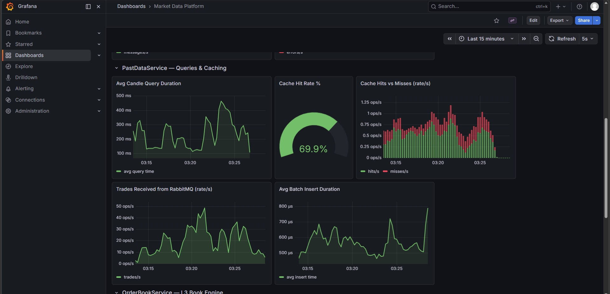

# Post 3 — The cache decision that would fail a system design interview

> **Image to attach:** `assets/linkedin/post-3-caching.png` (Grafana — PastDataService row).
>
> 

---

~400ms → ~8ms.

That's the latency drop on my historical market-data API after **one** decision.

The same decision would fail a system design interview today. ⚡

Here's what I did: I put the cache **in-process**. Caffeine, sitting inside the Historic Data Service itself.

No Redis. No Memcached. No shared cache tier.

📚 The textbook answer is Redis. Shared. Durable. Scales horizontally.

⚠️ The textbook answer also adds a network hop.

For an 8ms budget, that hop *is* the budget.

📊 From the live dashboard (screenshot below):
→ Cache hit rate: **~70% under mixed load**, climbs past **90% in steady state**
→ Cold query: ~400ms (Postgres scan + OHLCV aggregation)
→ Cache hit: ~8ms (mostly serialization)
→ Memory cost: a few MB

🎯 The honest tradeoff:

This does **not** scale horizontally. Add a second node and each gets its own cache. The day I run two replicas, this design has to change.

But I'm running a single-instance service in front of a UI. Why pay the Redis tax today for a problem I'll have at scale tomorrow?

🧠 The lesson I keep relearning:

Best practice optimizes for the problem you *might* have.
Right practice optimizes for the problem you *actually* have.

🔬 Coming in Part 4: I added a real-time L3 order book engine. Apply-event p99 sits at **~25µs warm / ~280µs cold**. One BigDecimal allocation is the prime suspect.

Would you have reached for Redis? Or made the same call?

\#SystemDesign #BackendEngineering #DistributedSystems #PerformanceEngineering #LowLatency

---

## Alternative opening hooks (pick one if the current opener feels off)

**A — Confession hook** (more humble, broader appeal)
> I made a caching decision last month that would get me roasted in a system design interview.
> It's also why my historical query latency dropped from ~400ms to ~8ms.

**B — Contradiction hook** (sharpest, best for senior engineers)
> Every system design guide says "use Redis for caching."
> I didn't. My historical query latency dropped 50×.
> Here's why the textbook answer was the wrong one — for this system.

**C — Question hook** (best for sparking comments)
> When does "best practice" become the wrong answer?
> I learned the hard way last month, while shaving 400ms off a historical market-data API.

---

## Why the current opener works

- **Line 1 is a number** — stops the scroll mid-feed. No setup, no preamble.
- **Line 2 names what the number is** — pays off the curiosity immediately.
- **Line 3 is the contrarian hook** — gives senior readers a reason to comment ("interesting take" / "I'd disagree").
- All three fit *above* LinkedIn's "see more" cutoff (~210 chars).

---

## Posting checklist

- [ ] Save the cropped Grafana screenshot as `assets/linkedin/post-3-caching.png` (PastDataService row only — no Grafana nav, no adjacent rows)
- [ ] Run `.\scripts\generate-traffic.ps1` for ~15 min before taking the screenshot
- [ ] Schedule for Tue/Wed, 8–10am IST (matches London open / NY pre-market window)
- [ ] First comment within 5 min: pin a note with the repo link
- [ ] Reply to every comment within 2 hours of posting (the algorithm rewards active threads)
- [ ] Comment substantively on 3–5 posts from target-audience accounts the same morning

## Optional tweaks

- **Too edgy?** Soften "would fail a system design interview" to "would raise eyebrows in a system design interview".
- **Want it shorter?** Cut the bulleted dashboard numbers — let the screenshot do that job and replace with one line: *"Cache hit rate ~70–90% depending on query mix. Cold ~400ms. Hit ~8ms."*
- **Want Part 4 open-ended?** Replace the BigDecimal tease with: *"Next: an L3 order book engine — and the latency numbers surprised me."*
